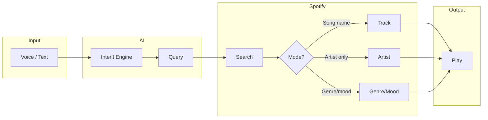

# AI Music Assistant

Control Spotify with natural language. Use voice or text — the app parses your intent and plays the right music.

---

## Quick Start

```bash
# 1. Install dependencies
pip install -r backend/requirements.txt

# 2. Add your keys to .env (see Setup below)
# 3. Start the backend
uvicorn backend.main:app --reload

# 4. In another terminal, start the frontend
cd frontend && npm install && npm run dev
```

Then visit **http://localhost:5173** and **http://localhost:8000/auth** to log in with Spotify. Use **Ctrl+Shift+L** to speak (website or voice client).

---

## How It Works



1. **You** speak or type a command (e.g. *"Play lo-fi beats"*).
2. **Intent Engine** (OpenAI) extracts the action and search query.
3. **Spotify** is searched for tracks.
4. **Mode** is chosen:
   - **Track** — you named a song → play that track
   - **Artist** — you named an artist → play their top tracks
   - **Multi** — genre/mood → play a mix of 10+ tracks
5. **Spotify** starts playback on your active device (shuffle on).

---

## Voice Input

| Method | How |
|--------|-----|
| **Website** | Hold **Ctrl+Shift+L** while speaking, then release. (Chrome/Edge) |
| **Terminal** | Run `python -X utf8 voice_client.py`, then press Enter or **Ctrl+Shift+L** to record. |

The website uses the browser’s Speech Recognition API; the terminal client uses Whisper.

---

## Setup

### Environment Variables (`.env`)

| Key | Where |
|-----|-------|
| `SPOTIFY_CLIENT_ID` | [developer.spotify.com/dashboard](https://developer.spotify.com/dashboard) |
| `SPOTIFY_CLIENT_SECRET` | Same app → Settings |
| `SPOTIFY_REDIRECT_URI` | `http://localhost:8000/callback` |
| `OPENAI_API_KEY` | [platform.openai.com/api-keys](https://platform.openai.com/api-keys) |

Add `http://localhost:8000/callback` as a Redirect URI in your Spotify app settings.

### Auth Flow

1. Visit `http://localhost:8000/auth`
2. Log in to Spotify and approve
3. Token is saved in `.cache` for future requests

---

## Project Structure

```
ai_music_assistant/
├── backend/
│   ├── main.py           # FastAPI routes
│   ├── spotify_client.py # Spotify API
│   ├── intent_engine.py  # OpenAI intent parser
│   └── ...
├── frontend/             # React + Tailwind
│   ├── src/
│   │   ├── components/   # VoiceAssistant, FeatureGrid, Sidebar
│   │   └── pages/        # Home, Top Tracks, Voice Control
│   └── ...
├── voice_client.py       # Terminal voice input (Whisper)
└── .env                  # API keys
```

---

## API Overview

| Endpoint | Description |
|----------|-------------|
| `GET /auth` | Start Spotify OAuth |
| `GET /top-tracks?limit=10` | Your top tracks |
| `POST /play` | Natural language → play music |
| `POST /play-track` | Play by Spotify URI |
| `GET /devices` | List playback devices |
| `GET /latest-command` | Last voice/text command |

---

## Tech Stack

- **Backend:** FastAPI, Spotipy, OpenAI, SQLAlchemy
- **Frontend:** React, Vite, Tailwind
- **Voice:** Web Speech API (browser), OpenAI Whisper (terminal)
